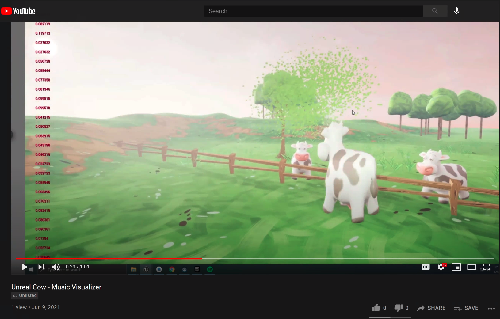

## Unreal Cow

Made with unreal engine, Blueprinting, Fmod, and C++.
The numbers on the left in red are raw data coming back from the C++ signal processing music data. The application listens to the internal audio.(playing on spotify in the youtube video) The cows rotation and size is changed by the music. This will also work on SteamVR to run on Oculus VR headsets.

[Youtube link]: https://www.youtube.com/watch?v=n0JHKwet1pM